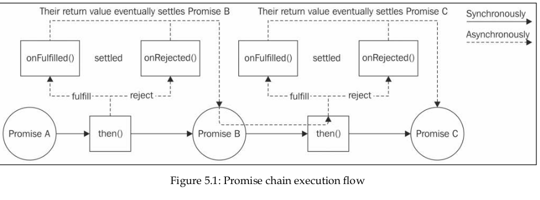

# Chapter 5 - Asynchronous Control Flow Patterns with Promises and Async/Await

## Notes

### 5.1 - Promises

Promises are a way to handle asynchronous operations in JavaScript.

- A Promise is an object that represents the eventual result (or failure) of an asynchronous operation and its resulting value.

- Promises jargon we have:
  - Fulfillment: The state of a Promise when it is resolved successfully.
  - Rejection: The state of a Promise when it is rejected.

- Once a **Primise** is **fulfilled** or **rejected**, it is said to be **settled**.

### 5.2 - Async/Await

Async/Await is a way to handle asynchronous operations in JavaScript. It is a way to handle asynchronous operations in JavaScript.

### 5.3 - Promisification

Promisification is a way to convert a function that returns a callback-based function into a function that returns a Promise.

#### Parallel Execution

- We can use Promise.all() to execute multiple promises in parallel. This is useful when we want to execute multiple promises in parallel and get the results when all of the promises have resolved.
- This helper function creates another Promise that fullfils only when all the promises receieved in the input are fullfilled.
- If theres is no casual relationship between the promises, we can use Promise.all() to execute multiple promises in parallel.
